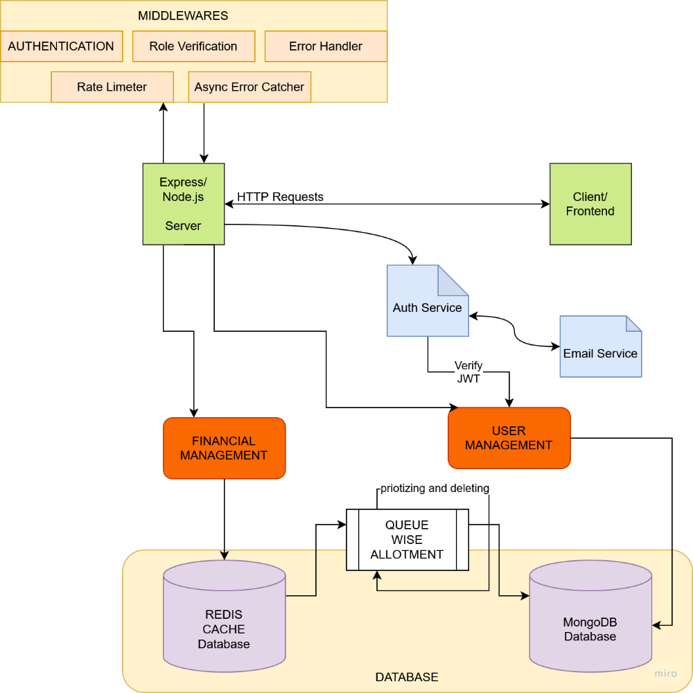

# Envint Finance Backend API

This repository contains the backend API for Envint Finance, a financial data processing and risk assessment platform.

## Table of Contents

- [Project Structure](#project-structure)
- [Technologies Used](#technologies-used)
- [Setup](#setup)
- [Environment Variables](#environment-variables)
- [Running the Application](#running-the-application)
- [API Endpoints](#api-endpoints)
- [Testing](#testing)
- [Workers](#workers)
- [Contributing](#contributing)
- [License](#license)



## Project Structure
```
backend/
├── config/
│   └── databases/
│       ├── mongoconn.js       # MongoDB connection setup
│       └── redis.js           # Redis connection setup
├── controllers/
│   ├── authController.js     # Authentication related controllers
│   ├── userController.js     # User related controllers
│   └── financialController.js # Financial data related controllers
├── middleware/
│   ├── authMiddleware.js     # Authentication middleware
│   ├── catchAsyncErrors.js   # Middleware for handling async errors
│   ├── errorHandler.js       # Error handling middleware
│   └── rateLimiter.js        # Rate limiting middleware
├── models/
│   ├── financialModel.js     # Financial data model
│   ├── passwordResetModel.js  # Password reset model
│   └── userModel.js          # User model
├── node_modules/             # Node packages
├── routes/
│   ├── authRoutes.js         # Authentication routes
│   ├── userRoutes.js         # User routes
│   └── financialRoutes.js    # Financial data routes
├── utils/
│   └── logger.js             # Logging utility (if implemented)
├── services/
│   ├── EmailService.js       # Email sending service
│   └── jwtServices.js        # JWT token service
├── test/
│   └── financialRoutes.test.js # Financial route testing
├── workers/
│   ├── financialQueue.js    # BullMQ queue setup for financial data processing
│   └── financialWorker.js   # BullMQ worker for financial data processing
├── .env                      # Environment variables
├── .gitignore                # Git ignore file
├── app.js                    # Express application setup
├── package-lock.json         # Package lock file
├── package.json              # Project dependencies and scripts
├── README.md                 # Project documentation
├── server.js                 # Server startup
└── test.js                   # General testing file
```
## Technologies Used

-   Node.js
-   Express.js
-   MongoDB (Mongoose)
-   Redis (ioredis, BullMQ)
-   JWT (jsonwebtoken)
-   bcrypt
-   nodemailer
-   dotenv
-   express-rate-limit
-   express-session
-   cors
-   cookie-parser
-   validator
-   jest (for testing)

## Setup

1.  *Clone the repository:*

    bash
    git clone <repository-url>
    cd backend
    

2.  *Install dependencies:*

    bash
    npm install
    

3.  **Create a .env file** in the root directory and populate it with the required environment variables (see [Environment Variables](#environment-variables)).

## Environment Variables

-   PORT: Port for the server to run on (e.g., 3000).
-   MONGO_URI: MongoDB connection string.
-   REDIS_HOST: Redis host address.
-   JWT_SECRET_KEY: Secret key for JWT.
-   JWT_EXPIRE: JWT token expiration time (e.g., 90d).
-   COOKIE_EXPIRE: Cookie expiration time (e.g., 90).
-   SMTP_HOST: SMTP host for email service.
-   SMTP_SERVICE: SMTP service (e.g., gmail).
-   SMTP_PORT: SMTP port.
-   SMTP_MAIL: Email address for sending emails.
-   SMTP_PASSWORD: Password for the email address.
-   FRONTEND_URL: URL of the frontend application.
-   NODE_ENV: Environment mode (development or production).
-   SESSION_SECRET: Secret key for express-session.

## Running the Application

1.  *Start the server:*
```
    bash
    npm run dev # for development
    npm start # for production
``` 

2.  *Start the worker:*
```
    bash
    node workers/financialWorker.js
``` 

## API Endpoints

### Authentication

-   POST /api/v1/auth/register: Register a new user.
-   POST /api/v1/auth/login: Log in a user.
-   POST /api/v1/auth/logout: Log out a user.
-   POST /api/v1/auth/forgot-password: Request password reset.
-   PUT /api/v1/auth/reset-password/:token: Reset password.

### User

-   PUT /api/v1/user/change-password: Change user password.
-   PUT /api/v1/user/me: Update user profile.
-   GET /api/v1/user/me: Get current user profile.
-   DELETE /api/v1/user/me: Delete current user.

### Financial

-   POST /api/v1/financial/uploadFinancialData: Upload financial data (requires authentication).
-   GET /api/v1/financial/getRiskAssessment: Get risk assessment data (requires authentication).

## Testing

To run tests:

bash
npm test


## Workers

The workers directory contains the BullMQ queue and worker for processing financial data.

-   financialQueue.js: Sets up the BullMQ queue.
-   financialWorker.js: Processes financial data jobs from the queue.

## License
This project is licensed under the MIT License.
